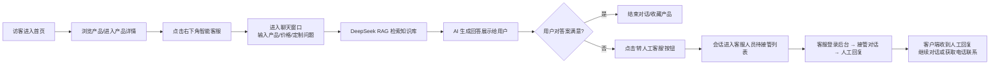
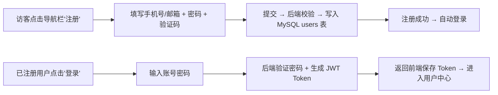
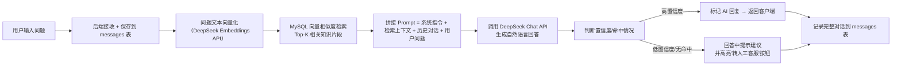
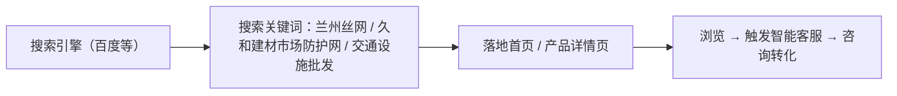

# 通达丝网官网 —— 产品需求文档 (PRD)

## 1. 产品概述

**通达丝网官网**是面向建筑工程、公路交通、市政、养殖等行业客户的企业官网，集中展示全品类金属丝网、工程防护护栏与道路交通设施产品，并提供**基于 DeepSeek 的 RAG 智能客服系统**，实现 7×24 小时在线咨询、工程采购对接与人工客服兜底。

- **核心目标**：以专业、可信的品牌形象展示产品，通过智能客服降低人工咨询压力，促成客户咨询与工程采购转化
- **目标用户**：建筑工地采购负责人、公路/市政工程承包商、养殖业主、小区物业管理人员、建材市场询价客户、注册会员客户、后台管理员
- **市场价值**：替代依赖线下名片/微信口传的推广模式，建立线上品牌展示窗口，结合 RAG 智能客服实现 24 小时产品查阅与业务接洽，AI 无法解决时一键转人工

---

## 2. 核心功能

### 2.1 用户角色

| 角色 | 注册方式 | 核心权限 |
|------|---------|---------|
| 访客 | 无需注册 | 浏览产品、公司介绍，点击电话/微信咨询，使用智能客服 |
| 注册客户 | 手机号/邮箱 + 密码注册 | 全部访客权限 + 登录/登出 + 查看历史咨询记录 + 留言保存 + 个人资料管理 |
| 客服人员 | 管理员后台创建账号 | 查看客户消息列表 + 回复客户消息 + 接管 AI 无法解答的会话 + 查看知识库 |
| 网站管理员 | 超级管理员账号 | 全部客服权限 + 产品数据 CRUD + 用户管理 + 知识库管理 + 消息记录查看/导出 |

### 2.2 功能模块（页面级 + 系统级）

#### 2.2.1 前台页面模块

1. **首页**：品牌 Hero 区、核心产品分类入口、主推产品展示、公司优势亮点、**智能客服悬浮窗入口**、联系方式快捷入口
2. **丝网产品中心页**：金属网类产品网格展示（不锈钢网、建筑网片、钢丝网、铁丝网、钢板网、电焊网、网格布），支持筛选
3. **护栏防护网页**：公路/铁路防护网、锌钢护栏、草坪护栏、市政护栏分类展示
4. **交通设施产品页**：路面警示类、隔离警示类、防撞防护类、安全标识类、交通标识类
5. **产品详情页**：产品大图、规格参数、应用场景、咨询入口（点击拨打 / 微信二维码 / **智能客服咨询**）
6. **关于我们页**：公司简介、经营范畴、仓储实力（配产品仓储图）
7. **联系我们页**：经营地址地图定位、负责人信息、电话拨打按钮、微信二维码、**在线咨询表单**
8. **登录/注册页**：手机号/邮箱 + 密码登录；新用户注册
9. **用户中心页**：个人资料编辑、修改密码、历史咨询记录、**我的消息列表**

#### 2.2.2 后台管理模块

10. **管理员登录页**：管理员账号密码登录
11. **产品管理页**：产品列表 + 新增/编辑/删除产品、上传产品图片、维护规格参数
12. **分类管理页**：产品三大类及子类的增删改、排序管理
13. **用户管理页**：注册会员列表、权限设置、封禁/解封
14. **客服工作台**：实时消息列表、正在等待/进行中的会话、一键接管人工回复
15. **知识库管理页**：RAG 知识库文档上传/编辑、按产品分类整理、向量化状态查看
16. **消息记录页**：全部客户-AI/人工对话记录、关键词搜索、导出 Excel

#### 2.2.3 智能客服与消息系统（核心新功能）

17. **智能客服聊天窗口**（悬浮窗 / 弹窗形式，全站可用）
    - 欢迎语 + 常见问题快捷按钮
    - 用户输入问题 → 调用 DeepSeek RAG 检索知识库 → 智能回答
    - 支持多轮上下文对话
    - 每轮回答下方附"**转人工客服**"按钮（AI 连续 2 轮无法命中知识库时自动高亮提示）
    - 一键拨打负责人电话（tel: 协议）
    - 回复区标注：🧠 AI 智能回答 / 👤 人工客服回复

18. **RAG 知识库系统**
    - 知识库文档来源：产品规格说明、公司介绍、常见问题 FAQ、配送政策、定制流程等
    - 文档上传/向量化：上传后自动切分、调用 DeepSeek 嵌入模型，存入 MySQL + 向量索引
    - 检索增强：用户提问 → 语义检索 Top-K 相关段落 → 拼接 Prompt → DeepSeek 大模型生成答案

19. **人工客服切换机制**
    - 转人工按钮：用户在智能客服窗口点击"转人工客服"后，该会话进入"待人工接管"队列
    - 客服人员登录后台 → 查看"待接管列表" → 点击接管 → 进入与客户的实时对话
    - 人工客服可标记会话状态：进行中 / 已解决 / 已关闭
    - 客户侧实时看到"人工客服已接入"提示

### 2.3 页面详情

| 页面名称 | 模块名称 | 功能描述 |
|---------|---------|---------|
| 首页 | 顶部导航栏 | Logo + 主导航（首页 / 产品中心 / 交通设施 / 关于我们 / 联系我们）+ 登录/注册按钮 / 用户头像或用户名 |
| 首页 | Hero 横幅区 | 大标题"通达丝网 · 专业金属丝网与工程防护"、副文案、主按钮"立即咨询（智能客服）" / "浏览产品" |
| 首页 | 核心品类区 | 6 大品类卡片，图标+名称，点击跳转对应分类页 |
| 首页 | 主推产品展示 | 4-6 款主打产品卡片，点击进入详情页 |
| 首页 | 公司优势区 | 4 项核心优势：全品类现货 / 工程级品质 / 规格可定制 / 便捷交付 |
| 首页 | 应用场景区 | 建筑工程 / 公路交通 / 市政工程 / 养殖防护 四大场景 |
| 首页 | 智能客服悬浮窗 | 右下角常驻，点击展开聊天窗口，默认 AI 客服，支持转人工；悬浮窗底部常驻微信二维码图片"扫一扫添加好友" |
| 登录/注册页 | 登录表单 | 手机号/邮箱 + 密码 + 登录按钮 + 忘记密码 + 去注册 |
| 登录/注册页 | 注册表单 | 手机号/邮箱 + 密码 + 确认密码 + 手机号验证码 + 同意协议 + 注册按钮 |
| 用户中心页 | 个人资料 | 头像 / 昵称 / 手机号 / 邮箱 编辑 |
| 用户中心页 | 历史咨询 | 历史对话记录列表，点击可查看详情 |
| 用户中心页 | 我的留言 | 在线留言历史及状态 |
| 产品详情页 | 图文详情 | 大图轮播、产品名、简介、核心特性列表、应用场景、规格说明、**"问一问 AI 客服"按钮** |
| 联系我们页 | 联系方式区 | 负责人：夏宇轩；电话：17352186111 / 13519672788（可点击拨打）；地址：久和建材市场 A 区 32-35；**微信二维码图片**（负责人个人微信，路径：`images/微信好友添加二维码.jpg`，展示"通达丝网 铁丝网小夏"扫码添加）；**在线留言表单（写入 MySQL）** |
| 后台 产品管理页 | 产品 CRUD | 产品列表表格 + 新增/编辑/删除 + 图片上传 + 富文本描述 + 规格字段 |
| 后台 客服工作台 | 实时消息列表 | 会话卡片（客户名/最后一条消息/时间/状态）+ 点击进入对话详情 + 回复消息 |
| 后台 知识库管理页 | 文档管理 | 文档列表 + 上传文档（PDF/Word/Markdown/纯文本）+ 编辑内容 + 重新向量化按钮 + 状态标识 |
| 后台 消息记录页 | 全量记录 | 筛选（客户名/时间/AI/人工）+ 对话全文查看 + 导出 |

---

## 3. 核心流程

### 3.1 访客浏览与智能咨询流程

### 3.2 用户注册登录流程

### 3.3 智能客服（RAG）核心处理流程

### 3.4 搜索引擎引流路径

---

## 4. 用户界面设计

### 4.1 设计风格

- **整体调性**：工业质感、专业可靠、干净利落。突出"工程品质"与"现货仓储"的安全感；智能客服风格需简洁现代
- **主色系**：以「通达红 TD」(#C81E1E) 作为品牌主色，搭配深灰 (#1F2937) 正文、金属银灰 (#4B5563) 辅助，背景使用浅灰 (#F5F5F5) 与纯白；**智能客服气泡**使用主色/白底对比色区分 AI 与人工

| 色位 | 色值 | 用途 |
|------|------|------|
| 主色 TD 红 | `#C81E1E` | Logo、主按钮、分类高亮、人工客服气泡标识 |
| 智能客服蓝 | `#2563EB` | AI 客服气泡底色 / 图标底色（与 TD 红互补） |
| 深灰 | `#1F2937` | 标题文字、导航 |
| 正文灰 | `#4B5563` | 正文描述 |
| 金属银 | `#9CA3AF` | 装饰线条、边框、图标底色 |
| 背景底色 | `#F5F5F5` | 区块背景交替 |
| 白色 | `#FFFFFF` | 卡片背景、内容区 |

- **按钮风格**：圆角 6px，主色填充按钮带微阴影；次要按钮为线框按钮
- **字体与字号**：中文字体优先 `PingFang SC / Microsoft YaHei / sans-serif`
  - 页面大标题 40-48px (h1)
  - 区块标题 28-32px (h2)
  - 产品名称 18px
  - 正文 14-16px
  - 标签 / 小字 12px
- **布局风格**：顶部导航栏 + 1200px 内容宽度 + 卡片网格
- **图标风格**：线性 SVG 图标（厚度 1.5-2px）

### 4.2 页面设计概览

| 页面名称 | 模块名称 | UI 元素要点 |
|---------|---------|------------|
| 首页 Hero | 横幅区 | 左侧标题+描述+双按钮，右侧产品大图或仓储图；滚动淡入动画 |
| 首页 品类入口 | 分类卡片 | 6 张等宽卡片，hover 上浮+阴影加深 |
| 首页 主推产品 | 产品网格 | 4 列产品卡片 |
| 首页 智能客服浮窗 | 聊天入口 | 右下角圆形按钮带消息图标；点击弹出 400×560 聊天窗口 |
| 智能客服聊天窗口 | 对话区 | 顶部标题"通达丝网智能客服"；消息气泡区分 AI（蓝底）/ 用户（白底灰边）/ 人工（红底）；底部输入框 + 发送按钮 + "转人工"链接 |
| 登录/注册页 | 表单 | 居中卡片式表单，左右 Tab 切换登录/注册 |
| 用户中心页 | 信息布局 | 左侧个人资料卡，右侧 Tab：我的咨询 / 我的留言 / 修改资料 |
| 后台管理页 | 左侧菜单 + 右侧内容区 | 侧边栏菜单（产品管理 / 分类管理 / 用户管理 / 客服工作台 / 知识库 / 消息记录）；右侧为对应操作界面 |
| 后台 客服工作台 | 对话界面 | 左侧会话列表（未读标识/状态），右侧对话详情 + 输入框 |
| 后台 知识库管理 | 文档列表 | 表格列出文档名/分类/字数/向量化状态/最近更新时间，顶部上传按钮 |
| 产品中心页 | 顶部筛选 Tab | 横向 Tab 栏，当前选中项红色下划线 |
| 产品详情页 | 左图右文 | 左侧大图，右侧产品名+特性+咨询按钮 |

### 4.3 响应式设计

- **策略**：桌面优先，移动端自适应
- **断点**：≥ 1200px 桌面 4-3 列；768-1199px 平板 3-2 列；< 768px 移动 2-1 列
- **移动端优化**：
  - 导航栏：Logo 居中 + 汉堡菜单
  - 智能客服悬浮窗：移动端保持右下角，聊天窗口全屏或 90% 宽度
  - 按钮与卡片间距 ≥ 44px 点击区
  - 联系电话按钮固定悬浮底部

---

## 5. 业务关键指标（新增）

| 指标 | 目标范围 | 说明 |
|------|---------|------|
| 智能客服接通率 | ≥ 90% | 用户发起对话后 AI 成功响应的比例 |
| 知识库命中率 | ≥ 70% | AI 回答命中知识库内容（高置信度）的比例 |
| 转人工率 | ≤ 20% | 用户主动转人工的比例（越低说明 AI 效果越好） |
| 平均响应时间 | ≤ 5s | 用户发送消息到收到回复的平均耗时 |
| 会话解决率 | ≥ 80% | 标记为"已解决"的会话占比 |
| 注册转化率 | 持续监测 | 访客到注册会员的转化 |

---

## 6. SEO 与基础运营需求

- **页面标题与 Meta**：每个页面独立 title / description
- **图片 ALT**：所有产品图片添加描述性 ALT 文本
- **联系方式结构化**：电话使用 `tel:` 协议
- **结构化数据**：首页添加 Organization JSON-LD
- **运营数据**：后台提供用户数、会话数、产品访问量等基础统计

---

## 7. 产品图片资源映射

`images/` 目录下的 **23 张**图片素材用于以下位置（新增第 23 张微信二维码）：

| 图片位置 | 使用页面 | 说明 |
|---------|---------|------|
| 不锈钢网 / 金属网产品图 | 丝网产品中心 / 详情页 | 金属网类产品展示 |
| 钢板网 / 电焊网图 | 产品中心页 | 金属网子品类示例 |
| 护栏 / 防护网图 | 护栏防护网页 / 首页主推产品 | 公路防护、锌钢护栏、市政护栏 |
| 交通设施图（反光道钉、减速带、路锥、防撞桶、反光背心等） | 交通设施产品页 | 各子分类示例 |
| 仓储实景图 | 首页 Hero / 关于我们页 | 展示"现货仓储"优势 |
| 产品标签图（TD 红标） | 关于我们 / 品牌介绍 | 展示品牌标识 |
| **微信好友添加二维码**（`微信好友添加二维码.jpg`） | **首页悬浮窗底部 / 联系我们页 / 产品详情页咨询区** | **负责人夏宇轩微信二维码（通达丝网 铁丝网小夏），供客户扫码添加好友或浏览产品时快速联系**，尺寸建议 200×200px 内置于页面 |
