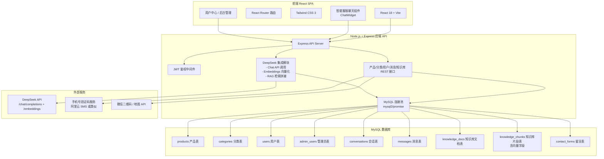

# 通达丝网官网 —— 技术架构文档

## 1. 架构设计

### 1.1 总体架构图（前后端分离 + MySQL + DeepSeek RAG）



**架构说明**：
- 前端 React SPA 负责页面渲染、路由切换、智能客服聊天组件交互
- 后端 Node.js + Express 提供 REST API，承担鉴权、产品 CRUD、消息收发、知识库管理、DeepSeek RAG 调用
- MySQL 作为主数据库存储产品、用户、消息、知识库等全部业务数据
- DeepSeek API 同时承担两重角色：**文本生成（Chat Completions）** 与 **文本向量化（Embeddings）**
- 知识库文档在上传后由后端自动切分为片段，调用 DeepSeek Embeddings 生成向量，存入 MySQL `knowledge_chunks` 表的向量字段

---

## 2. 技术选型说明

| 层位 | 技术选型 | 版本 / 配置 | 说明 |
|------|---------|------------|------|
| 前端框架 | React | 18 | 组件化开发 |
| 构建工具 | Vite | 5.x | 极速 HMR |
| 路由 | React Router | 6.x | 客户端多页面路由 |
| 样式 | Tailwind CSS | 3.x | 原子化 CSS |
| 状态管理 | Zustand / React Context | latest | 管理用户登录态、聊天消息状态 |
| 图表/图标 | Lucide React | latest | 线性 SVG 图标 |
| HTTP 请求 | Axios | latest | 封装 API 调用 |
| **后端框架** | **Node.js + Express** | **Node.js ≥ 18, Express 4.x** | **提供 REST API 服务** |
| **数据库** | **MySQL** | **8.0+** | **主数据库（支持向量列 / JSON 列）** |
| **数据库驱动** | **mysql2** | **latest** | **Promise 风格连接池** |
| **鉴权** | **JWT (jsonwebtoken)** | **latest** | **登录态验证** |
| **密码加密** | **bcryptjs** | **latest** | **密码哈希** |
| **OR / Migrations** | **自建原生 SQL** | - | **轻量项目使用原生 SQL 脚本初始化** |
| **大模型** | **DeepSeek API** | **deepseek-chat / deepseek-embed** | **智能问答 + 文本向量化** |
| **文件上传** | **multer** | **latest** | **产品图 + 知识库文档上传** |
| **CORS** | **cors** | **latest** | **跨域中间件** |
| **环境变量** | **dotenv** | **latest** | **管理敏感配置** |
| **实时消息** | **SSE (Server-Sent Events) 或短轮询** | - | **客服工作台实时消息推送** |

### 2.1 项目目录结构

```
通达丝网公司官网/
├── frontend/                   # 前端 SPA
│   ├── src/
│   │   ├── components/
│   │   │   ├── Layout/         # Header / Footer / Navbar / 悬浮客服按钮
│   │   │   ├── ChatWidget/     # 智能客服聊天窗口组件
│   │   │   ├── ProductCard/
│   │   │   └── ...
│   │   ├── pages/
│   │   │   ├── Home.jsx
│   │   │   ├── MetalMesh.jsx
│   │   │   ├── Guardrail.jsx
│   │   │   ├── TrafficTools.jsx
│   │   │   ├── ProductDetail.jsx
│   │   │   ├── About.jsx
│   │   │   ├── Contact.jsx
│   │   │   ├── Login.jsx        # 登录 / 注册
│   │   │   ├── UserCenter.jsx   # 用户中心
│   │   │   └── admin/           # 后台管理子目录
│   │   │       ├── AdminLogin.jsx
│   │   │       ├── Dashboard.jsx
│   │   │       ├── ProductManage.jsx
│   │   │       ├── CategoryManage.jsx
│   │   │       ├── UserManage.jsx
│   │   │       ├── ServiceDesk.jsx   # 客服工作台
│   │   │       ├── KnowledgeBase.jsx # 知识库管理
│   │   │       └── MessageLog.jsx    # 消息记录
│   │   ├── api/                  # API 请求封装
│   │   │   ├── index.js          # axios 实例
│   │   │   ├── products.js
│   │   │   ├── auth.js
│   │   │   ├── chat.js
│   │   │   └── admin.js
│   │   ├── store/                # 状态管理
│   │   │   └── useAuthStore.js
│   │   ├── App.jsx
│   │   ├── main.jsx
│   │   └── index.css
│   ├── package.json
│   └── vite.config.js
├── backend/                      # 后端 API
│   ├── src/
│   │   ├── server.js             # Express 入口
│   │   ├── routes/               # 路由
│   │   │   ├── auth.js           # 登录/注册
│   │   │   ├── admin.js          # 管理员登录
│   │   │   ├── products.js       # 产品 CRUD
│   │   │   ├── categories.js
│   │   │   ├── users.js
│   │   │   ├── chat.js           # 消息 + 智能客服
│   │   │   ├── knowledge.js      # 知识库管理
│   │   │   └── contact.js        # 在线留言
│   │   ├── controllers/          # 业务逻辑层
│   │   ├── middleware/           # JWT、错误处理、日志
│   │   ├── models/               # 数据模型描述 + SQL 模板
│   │   ├── services/             # 业务服务层
│   │   │   ├── deepseekService.js    # DeepSeek API 封装
│   │   │   ├── ragService.js          # RAG 检索 + 生成
│   │   │   └── vectorService.js       # 向量计算与相似度检索
│   │   ├── utils/                # 工具函数（密码、token、文档切分）
│   │   ├── config/               # 数据库连接、环境变量
│   │   └── db/                   # 数据库初始化脚本
│   │       └── init.sql          # 建表 + 初始数据
│   ├── uploads/                  # 上传图片、文档存储目录
│   ├── .env.example
│   ├── package.json
│   └── README.md
├── images/                       # 产品实物图（22 张原始素材）
└── README.md
```

---

## 3. 前端路由定义

| 路由路径 | 页面组件 | 权限 | 说明 |
|---------|---------|------|------|
| `/` | Home.jsx | 公开 | 首页 |
| `/products/metal-mesh` | MetalMesh.jsx | 公开 | 金属丝网产品中心 |
| `/products/guardrail` | Guardrail.jsx | 公开 | 护栏防护网 |
| `/products/traffic` | TrafficTools.jsx | 公开 | 交通设施产品 |
| `/product/:id` | ProductDetail.jsx | 公开 | 产品详情页 |
| `/about` | About.jsx | 公开 | 关于我们 |
| `/contact` | Contact.jsx | 公开 | 联系我们 |
| `/login` | Login.jsx | 公开 | 登录 / 注册 |
| `/user` | UserCenter.jsx | 需要登录 | 用户中心 |
| `/admin/login` | AdminLogin.jsx | 公开 | 管理员登录 |
| `/admin/dashboard` | Dashboard.jsx | 管理员 | 后台总览 |
| `/admin/products` | ProductManage.jsx | 管理员 | 产品管理 |
| `/admin/categories` | CategoryManage.jsx | 管理员 | 分类管理 |
| `/admin/users` | UserManage.jsx | 管理员 | 用户管理 |
| `/admin/service-desk` | ServiceDesk.jsx | 客服/管理员 | 客服工作台 |
| `/admin/knowledge` | KnowledgeBase.jsx | 管理员 | 知识库管理 |
| `/admin/messages` | MessageLog.jsx | 管理员 | 消息记录 |
| `*` | 跳转至 `/` | - | 404 兜底 |

---

## 4. 后端 API 接口定义

所有接口统一前缀 `/api`，响应格式为 `{ code, message, data }`

### 4.1 鉴权模块

| Method | Path | 说明 | 鉴权 | 请求体 | 响应 |
|--------|------|------|------|--------|------|
| POST | `/auth/register` | 用户注册 | 否 | `{ phoneOrEmail, password, nickname?, verifyCode }` | `{ token, user }` |
| POST | `/auth/login` | 用户登录 | 否 | `{ phoneOrEmail, password }` | `{ token, user }` |
| POST | `/auth/logout` | 用户登出 | JWT | - | `{ success: true }` |
| GET | `/auth/profile` | 获取个人资料 | JWT | - | `{ id, nickname, phone, email, avatar }` |
| PUT | `/auth/profile` | 更新个人资料 | JWT | `{ nickname, avatar }` | - |
| PUT | `/auth/password` | 修改密码 | JWT | `{ oldPassword, newPassword }` | - |

### 4.2 产品与分类模块

| Method | Path | 说明 | 鉴权 | 请求体 | 响应 |
|--------|------|------|------|--------|------|
| GET | `/products` | 获取产品列表（支持 `?category=metal-mesh`） | 否 | - | `[{ id, name, category, image, description, ... }]` |
| GET | `/products/:id` | 产品详情 | 否 | - | `{ id, name, category, images, description, features, applications, specs }` |
| POST | `/products` | 新增产品 | 管理员 JWT | `{ name, categoryId, description, features, images, specs }` | `{ id }` |
| PUT | `/products/:id` | 更新产品 | 管理员 JWT | 同上 | `{ success }` |
| DELETE | `/products/:id` | 删除产品 | 管理员 JWT | - | `{ success }` |
| GET | `/categories` | 获取全部分类（含子类） | 否 | - | `[{ id, name, children: [...] }]` |
| POST | `/categories` | 新增分类 | 管理员 JWT | `{ name, parentId, icon }` | `{ id }` |
| PUT | `/categories/:id` | 更新分类 | 管理员 JWT | 同上 | `{ success }` |
| DELETE | `/categories/:id` | 删除分类 | 管理员 JWT | - | `{ success }` |
| POST | `/upload/image` | 上传产品图片 | 管理员 JWT | FormData | `{ url }` |

### 4.3 消息与智能客服模块

| Method | Path | 说明 | 鉴权 | 请求体 | 响应 |
|--------|------|------|------|--------|------|
| GET | `/chat/conversations` | 获取当前用户会话列表 | JWT (可选，访客也可) | - | `[{ id, title, lastMessage, status, updatedAt }]` |
| GET | `/chat/conversations/:id/messages` | 获取单会话全部消息 | JWT | - | `[{ id, role, content, senderType, timestamp }]` |
| POST | `/chat/message` | 发送一条消息（自动触发 AI 回复） | JWT (可选) | `{ conversationId?, content }` | `{ message, reply }` |
| POST | `/chat/transfer-human` | 转人工客服 | JWT (可选) | `{ conversationId, reason }` | `{ success, status: 'pending' }` |
| GET | `/chat/stream/:conversationId` | SSE 流式接收消息 | JWT | - | 流式推送新消息 |

### 4.4 客服工作台模块

| Method | Path | 说明 | 鉴权 | 请求体 | 响应 |
|--------|------|------|------|--------|------|
| GET | `/admin/conversations` | 获取全部会话（分页、筛选状态） | 管理员/客服 JWT | `?status=&page=` | `{ total, items: [...] }` |
| POST | `/admin/conversations/:id/takeover` | 接管会话 | 管理员/客服 JWT | - | `{ success }` |
| POST | `/admin/conversations/:id/message` | 人工回复消息 | 管理员/客服 JWT | `{ content }` | `{ message }` |
| PUT | `/admin/conversations/:id/status` | 标记会话状态 | 管理员/客服 JWT | `{ status: 'active' / 'resolved' / 'closed' }` | `{ success }` |
| GET | `/admin/messages/export` | 导出消息记录（Excel） | 管理员 JWT | `?startDate=&endDate=` | 文件流 |

### 4.5 知识库管理模块

| Method | Path | 说明 | 鉴权 | 请求体 | 响应 |
|--------|------|------|------|--------|------|
| GET | `/knowledge/docs` | 获取知识库文档列表 | 管理员 JWT | `?category=` | `{ total, items: [...] }` |
| POST | `/knowledge/upload` | 上传文档并切分+向量化 | 管理员 JWT | FormData (pdf/word/md/txt) | `{ id, title, chunkCount, vectorized }` |
| POST | `/knowledge/docs` | 直接新增文档（手动录入文本） | 管理员 JWT | `{ title, content, category }` | `{ id }` |
| PUT | `/knowledge/docs/:id` | 更新文档内容（重新向量化） | 管理员 JWT | `{ title, content }` | `{ success }` |
| DELETE | `/knowledge/docs/:id` | 删除文档及其向量 | 管理员 JWT | - | `{ success }` |
| POST | `/knowledge/retrieve` | 手动测试知识库检索（用于调试） | 管理员 JWT | `{ query, topK: 5 }` | `{ results: [...] }` |

### 4.6 用户管理模块

| Method | Path | 说明 | 鉴权 | 请求体 | 响应 |
|--------|------|------|------|--------|------|
| POST | `/admin/login` | 管理员登录 | 否 | `{ username, password }` | `{ token, user }` |
| GET | `/admin/users` | 注册会员列表 | 管理员 JWT | `?page=&keyword=` | `{ total, items: [...] }` |
| PUT | `/admin/users/:id/status` | 封禁/解封用户 | 管理员 JWT | `{ status: 'active' / 'banned' }` | `{ success }` |

### 4.7 在线留言模块

| Method | Path | 说明 | 鉴权 | 请求体 | 响应 |
|--------|------|------|------|--------|------|
| POST | `/contact/submit` | 提交在线留言 | 否 | `{ name, phone, message }` | `{ id }` |
| GET | `/admin/contacts` | 留言列表 | 管理员 JWT | `?page=` | `{ total, items: [...] }` |
| DELETE | `/admin/contacts/:id` | 删除留言 | 管理员 JWT | - | `{ success }` |

---

## 5. MySQL 数据库设计

### 5.1 表结构一览

```
┌──────────────────────┐      ┌──────────────────────┐
│ users                │      │ admin_users          │
│ 注册会员表            │      │ 管理员/客服表         │
└──────────────────────┘      └──────────────────────┘
           │
           ▼
┌──────────────────────┐      ┌──────────────────────┐
│ categories           │──┐   │ conversations        │
│ 产品分类表            │  │   │ 会话表               │
└──────────────────────┘  │   └──────────────────────┘
           │               │           │
           ▼               │           ▼
┌──────────────────────┐  │  ┌──────────────────────┐
│ products             │  │  │ messages             │
│ 产品表               │  │  │ 消息表（用户/AI/人工） │
└──────────────────────┘  │  └──────────────────────┘
                           │
                           ▼
                   ┌──────────────────────┐
                   │ knowledge_docs       │
                   │ 知识库文档表          │
                   └──────────────────────┘
                              │
                              ▼
                   ┌──────────────────────┐
                   │ knowledge_chunks     │
                   │ 知识库片段表（含向量） │
                   └──────────────────────┘

┌──────────────────────┐
│ contact_forms        │
│ 在线留言表            │
└──────────────────────┘
```

### 5.2 建表 SQL 详细定义（init.sql）

```sql
-- =============================================
-- 通达丝网官网 MySQL 初始化脚本
-- 编码: utf8mb4 / 排序: utf8mb4_unicode_ci
-- =============================================
SET NAMES utf8mb4;
SET FOREIGN_KEY_CHECKS = 0;

-- ---------------------------------------------
-- 1. 分类表
-- ---------------------------------------------
CREATE TABLE IF NOT EXISTS categories (
    id INT AUTO_INCREMENT PRIMARY KEY,
    name VARCHAR(100) NOT NULL COMMENT '分类名',
    parent_id INT DEFAULT NULL COMMENT '父分类ID',
    icon VARCHAR(50) DEFAULT NULL COMMENT '图标标识',
    slug VARCHAR(50) DEFAULT NULL COMMENT '路由路径标识（metal-mesh / guardrail / traffic）',
    sort_order INT DEFAULT 0 COMMENT '排序权重',
    created_at DATETIME DEFAULT CURRENT_TIMESTAMP,
    updated_at DATETIME DEFAULT CURRENT_TIMESTAMP ON UPDATE CURRENT_TIMESTAMP,
    INDEX idx_parent (parent_id),
    INDEX idx_slug (slug)
) ENGINE=InnoDB DEFAULT CHARSET=utf8mb4;

-- ---------------------------------------------
-- 2. 产品表
-- ---------------------------------------------
CREATE TABLE IF NOT EXISTS products (
    id INT AUTO_INCREMENT PRIMARY KEY,
    name VARCHAR(200) NOT NULL COMMENT '产品名称',
    category_id INT NOT NULL COMMENT '所属分类ID',
    slug VARCHAR(100) UNIQUE COMMENT 'SEO友好 URL',
    description TEXT COMMENT '产品简介',
    image VARCHAR(500) COMMENT '主图路径',
    images JSON COMMENT '多张图 JSON 数组 ["url1","url2"]',
    features JSON COMMENT '核心特性 JSON 数组',
    applications JSON COMMENT '应用场景 JSON 数组',
    specs JSON COMMENT '规格参数 JSON 对象',
    is_featured TINYINT(1) DEFAULT 0 COMMENT '是否首页推荐',
    status TINYINT(1) DEFAULT 1 COMMENT '1=上架 0=下架',
    view_count INT DEFAULT 0 COMMENT '访问计数',
    created_at DATETIME DEFAULT CURRENT_TIMESTAMP,
    updated_at DATETIME DEFAULT CURRENT_TIMESTAMP ON UPDATE CURRENT_TIMESTAMP,
    FOREIGN KEY (category_id) REFERENCES categories(id),
    INDEX idx_category (category_id),
    INDEX idx_featured (is_featured)
) ENGINE=InnoDB DEFAULT CHARSET=utf8mb4;

-- ---------------------------------------------
-- 3. 用户表（注册会员）
-- ---------------------------------------------
CREATE TABLE IF NOT EXISTS users (
    id INT AUTO_INCREMENT PRIMARY KEY,
    nickname VARCHAR(100) DEFAULT NULL,
    phone VARCHAR(20) UNIQUE COMMENT '手机号',
    email VARCHAR(200) UNIQUE COMMENT '邮箱',
    password VARCHAR(255) NOT NULL COMMENT 'bcrypt 哈希',
    avatar VARCHAR(500) DEFAULT NULL,
    status TINYINT(1) DEFAULT 1 COMMENT '1=正常 0=封禁',
    created_at DATETIME DEFAULT CURRENT_TIMESTAMP,
    updated_at DATETIME DEFAULT CURRENT_TIMESTAMP ON UPDATE CURRENT_TIMESTAMP,
    INDEX idx_phone (phone),
    INDEX idx_email (email)
) ENGINE=InnoDB DEFAULT CHARSET=utf8mb4;

-- ---------------------------------------------
-- 4. 管理员表（含客服人员）
-- ---------------------------------------------
CREATE TABLE IF NOT EXISTS admin_users (
    id INT AUTO_INCREMENT PRIMARY KEY,
    username VARCHAR(100) UNIQUE NOT NULL,
    password VARCHAR(255) NOT NULL COMMENT 'bcrypt 哈希',
    role VARCHAR(20) DEFAULT 'agent' COMMENT 'super=超级管理员 / agent=客服',
    name VARCHAR(100) DEFAULT NULL COMMENT '真实姓名',
    avatar VARCHAR(500) DEFAULT NULL,
    status TINYINT(1) DEFAULT 1 COMMENT '1=正常 0=禁用',
    created_at DATETIME DEFAULT CURRENT_TIMESTAMP,
    updated_at DATETIME DEFAULT CURRENT_TIMESTAMP ON UPDATE CURRENT_TIMESTAMP
) ENGINE=InnoDB DEFAULT CHARSET=utf8mb4;

-- 初始化超级管理员（首次部署时执行，密码需用 bcrypt 预先生成）
-- 示例用户名: admin / 密码示例: admin123456（请上线前修改）
INSERT IGNORE INTO admin_users (username, password, role, name)
VALUES ('admin', '$2a$10$N9qo8uLOickgx2ZMRZoMyeIjZAgcfl7p92ldGxad68LJZdL17lhWy', 'super', '系统管理员');

-- ---------------------------------------------
-- 5. 会话表
-- ---------------------------------------------
CREATE TABLE IF NOT EXISTS conversations (
    id INT AUTO_INCREMENT PRIMARY KEY,
    user_id INT DEFAULT NULL COMMENT '关联注册用户ID（可为空=访客）',
    visitor_name VARCHAR(100) DEFAULT '访客用户',
    title VARCHAR(200) DEFAULT '新的对话',
    status VARCHAR(20) DEFAULT 'ai' COMMENT 'ai=AI客服中 / pending=待人工接管 / human=人工服务中 / resolved=已解决 / closed=已关闭',
    agent_id INT DEFAULT NULL COMMENT '接管的客服人员ID',
    last_message VARCHAR(500) DEFAULT NULL,
    created_at DATETIME DEFAULT CURRENT_TIMESTAMP,
    updated_at DATETIME DEFAULT CURRENT_TIMESTAMP ON UPDATE CURRENT_TIMESTAMP,
    FOREIGN KEY (user_id) REFERENCES users(id) ON DELETE SET NULL,
    FOREIGN KEY (agent_id) REFERENCES admin_users(id) ON DELETE SET NULL,
    INDEX idx_user (user_id),
    INDEX idx_status (status),
    INDEX idx_agent (agent_id)
) ENGINE=InnoDB DEFAULT CHARSET=utf8mb4;

-- ---------------------------------------------
-- 6. 消息表（核心：用户/AI/人工 全部消息）
-- ---------------------------------------------
CREATE TABLE IF NOT EXISTS messages (
    id INT AUTO_INCREMENT PRIMARY KEY,
    conversation_id INT NOT NULL COMMENT '所属会话ID',
    sender_type VARCHAR(20) NOT NULL COMMENT 'user=用户 / ai=AI客服 / agent=人工客服 / system=系统消息',
    sender_id INT DEFAULT NULL COMMENT '关联用户或管理员ID',
    content TEXT NOT NULL COMMENT '消息内容',
    confidence DECIMAL(4,3) DEFAULT NULL COMMENT 'AI 回答置信度（0-1）',
    retrieved_docs JSON COMMENT '本次 RAG 检索命中的片段ID列表 JSON',
    created_at DATETIME DEFAULT CURRENT_TIMESTAMP,
    FOREIGN KEY (conversation_id) REFERENCES conversations(id) ON DELETE CASCADE,
    INDEX idx_conversation (conversation_id),
    INDEX idx_sender (sender_type),
    INDEX idx_created (created_at)
) ENGINE=InnoDB DEFAULT CHARSET=utf8mb4;

-- ---------------------------------------------
-- 7. 知识库文档表
-- ---------------------------------------------
CREATE TABLE IF NOT EXISTS knowledge_docs (
    id INT AUTO_INCREMENT PRIMARY KEY,
    title VARCHAR(200) NOT NULL COMMENT '文档标题',
    category VARCHAR(100) DEFAULT 'general' COMMENT '文档分类（产品说明/FAQ/配送政策等）',
    file_path VARCHAR(500) DEFAULT NULL COMMENT '原文件存储路径（上传文件时）',
    file_type VARCHAR(20) DEFAULT 'text' COMMENT 'pdf / word / md / txt / manual',
    content LONGTEXT COMMENT '文档纯文本内容（切分用）',
    chunk_count INT DEFAULT 0 COMMENT '切分后的片段数',
    vectorized TINYINT(1) DEFAULT 0 COMMENT '0=未向量化 1=已向量化',
    created_by INT DEFAULT NULL COMMENT '创建人 admin_user ID',
    created_at DATETIME DEFAULT CURRENT_TIMESTAMP,
    updated_at DATETIME DEFAULT CURRENT_TIMESTAMP ON UPDATE CURRENT_TIMESTAMP,
    INDEX idx_category (category),
    INDEX idx_vectorized (vectorized)
) ENGINE=InnoDB DEFAULT CHARSET=utf8mb4;

-- ---------------------------------------------
-- 8. 知识库片段表（含向量字段，RAG 核心）
-- ---------------------------------------------
-- 向量字段存储策略：使用 TEXT/BLOB 存储 JSON 数组格式的浮点向量
-- 相似度检索通过 MySQL 的自建余弦距离函数实现
-- （或可选择接入 Milvus / pgvector 等向量数据库）
CREATE TABLE IF NOT EXISTS knowledge_chunks (
    id INT AUTO_INCREMENT PRIMARY KEY,
    doc_id INT NOT NULL COMMENT '所属文档ID',
    chunk_index INT DEFAULT 0 COMMENT '片段索引',
    content TEXT NOT NULL COMMENT '片段文本',
    embedding TEXT COMMENT '向量（JSON 数组格式）',
    embedding_dim INT DEFAULT 1536 COMMENT '向量维度（DeepSeek 默认 1536）',
    token_count INT DEFAULT 0,
    created_at DATETIME DEFAULT CURRENT_TIMESTAMP,
    FOREIGN KEY (doc_id) REFERENCES knowledge_docs(id) ON DELETE CASCADE,
    INDEX idx_doc (doc_id)
) ENGINE=InnoDB DEFAULT CHARSET=utf8mb4;

-- ---------------------------------------------
-- 9. 在线留言表（联系我们页面提交）
-- ---------------------------------------------
CREATE TABLE IF NOT EXISTS contact_forms (
    id INT AUTO_INCREMENT PRIMARY KEY,
    name VARCHAR(100) NOT NULL,
    phone VARCHAR(20) NOT NULL,
    message TEXT,
    user_id INT DEFAULT NULL COMMENT '若为登录用户',
    status TINYINT(1) DEFAULT 0 COMMENT '0=未处理 1=已处理',
    created_at DATETIME DEFAULT CURRENT_TIMESTAMP,
    FOREIGN KEY (user_id) REFERENCES users(id) ON DELETE SET NULL,
    INDEX idx_status (status),
    INDEX idx_phone (phone)
) ENGINE=InnoDB DEFAULT CHARSET=utf8mb4;

SET FOREIGN_KEY_CHECKS = 1;
```

### 5.3 向量相似度检索核心 SQL 示例

由于 MySQL 原生不支持向量算子，通过**应用层余弦距离计算**实现相似度排序：

```sql
-- Step 1: 查询全部已向量化片段（服务层缓存向量数组）
SELECT id, content, embedding FROM knowledge_chunks WHERE embedding IS NOT NULL;

-- Step 2: 应用层计算每个 embedding 与 query_embedding 的余弦相似度
-- cos_sim = dot(A, B) / (norm(A) * norm(B))
-- 返回 Top-K 最高相似度片段拼接为 RAG 上下文
```

> **可选替代方案**：若后续性能需要提升，可迁移至 PostgreSQL + pgvector，或接入 Milvus 向量数据库；当前方案满足中小规模知识库需求。

---

## 6. DeepSeek RAG 核心服务实现说明

### 6.1 环境变量配置（backend/.env）

```env
# 服务器配置
PORT=3001
NODE_ENV=development

# MySQL 数据库
DB_HOST=127.0.0.1
DB_PORT=3306
DB_USER=root
DB_PASSWORD=your_password
DB_NAME=tongda_silk

# JWT
JWT_SECRET=your_jwt_secret_key_please_change
JWT_EXPIRES_IN=7d

# DeepSeek API（关键）
DEEPSEEK_API_KEY=sk-xxxxxxxxxxxxxxxxxxxxxx
DEEPSEEK_API_BASE=https://api.deepseek.com/v1
DEEPSEEK_CHAT_MODEL=deepseek-chat
DEEPSEEK_EMBED_MODEL=deepseek-embed
RAG_TOP_K=5
RAG_CHUNK_SIZE=500
RAG_CHUNK_OVERLAP=50

# 文件上传
UPLOAD_PATH=./uploads
MAX_FILE_SIZE=10485760

# 短信（可选，用于注册验证码）
SMS_PROVIDER=aliyun
SMS_ACCESS_KEY=xxxxxx
SMS_SECRET=xxxxxx
SMS_TEMPLATE_CODE=SMS_12345678
```

### 6.2 核心系统提示词模板（System Prompt）

```
你是"通达丝网"官方网站的智能客服助手。
公司主营：全品类金属丝网（不锈钢网、钢板网、电焊网、建筑网片等）、工程防护护栏（公路/铁路/锌钢护栏等）以及交通设施产品。
公司负责人：夏宇轩，电话：17352186111 / 13519672788。
地址：久和建材市场 A 区 32-35。

请严格基于以下检索到的知识库内容回答用户问题。
- 若知识库中有相关内容，用简洁清晰的中文回答，并可推荐相关产品。
- 若知识库中没有明确答案，请诚恳说明"关于此问题，建议您直接联系我们的客服人员"，并提示点击"转人工客服"按钮或拨打上述电话。
- 不得编造产品规格、价格或承诺未经核实的信息。
- 语气友好、专业，符合 B2B 工程采购场景。
- 回答不超过 300 字。

【检索到的知识库内容】
{retrieved_context}

【历史对话摘要】
{history_summary}
```

### 6.3 服务端数据流

```
用户消息（POST /api/chat/message）
    │
    ▼
1. 写入 messages 表（role=user）
    │
    ▼
2. 调用 DeepSeek Embeddings API → 生成 query_embedding
    │
    ▼
3. 从 knowledge_chunks 表取出全部向量化片段
   → 应用层计算余弦相似度 → 取 Top-K（默认 5）片段
   → 拼接为检索上下文 context
    │
    ▼
4. 取会话最近 N 条消息 + 系统提示词 + context
   → 构造完整 Prompt
    │
    ▼
5. 调用 DeepSeek Chat API（stream=true 可选）
   → 接收流式回复
    │
    ▼
6. 写入 messages 表（role=ai, confidence, retrieved_docs）
    │
    ▼
7. 返回前端：{ message, reply, suggestHuman: true/false }
```

---

## 7. 安全性与鉴权方案

- **密码存储**：`bcryptjs` 加盐哈希，cost=10
- **Token 机制**：用户与管理员使用两套独立 JWT Token（`Authorization: Bearer xxx`），分别存储用户 ID 与管理员 ID + role
- **密码重置**：一期暂不提供"忘记密码"邮件链路，管理员可在后台为用户重置临时密码
- **接口频率限制**：`/api/chat/message` 限制单 IP 每分钟 60 次，防止滥用
- **CORS**：白名单模式，仅允许前端域名跨域
- **文件上传**：严格校验文件类型（图片：jpg/png/webp，文档：pdf/docx/md/txt）与大小上限

---

## 8. 性能与部署方案

### 8.1 部署架构

```
                                ┌────────────┐
                                │   浏览器     │
                                └──────┬─────┘
                                       │ HTTPS
                                       ▼
                                ┌────────────┐
                                │   Nginx    │  反向代理 / 静态文件 / SSL
                                └──┬─────┬───┘
                                   │     │
           / (前端静态) ───────────┘     │
                                   │     └───── /api/* ───┐
                                   ▼                      ▼
                            ┌──────────┐            ┌────────────┐
                            │ 前端 dist │            │ Express API  │
                            │  (Vite build) │         │  (Node.js)  │
                            └──────────┘            └──────┬─────┘
                                                           │
                                                           ▼
                                                     ┌─────────┐
                                                     │ MySQL 8 │
                                                     └────┬────┘
                                                          │
                                             外部 ────────┘
                                       ┌──────────────┐
                                       │ DeepSeek API │
                                       └──────────────┘
```

### 8.2 构建命令

```bash
# 前端
cd frontend
npm install
npm run build        # 产物输出至 frontend/dist

# 后端
cd backend
npm install
npm run init-db      # 执行 src/db/init.sql（首次部署）
npm start            # 或 pm2 start src/server.js --name tongda-api
```

### 8.3 部署建议

- **生产环境**：推荐使用 **PM2** 管理 Node 进程，Nginx 做反向代理与静态文件服务
- **数据库**：推荐 MySQL 8.0（对 JSON 类型有原生支持）
- **文件存储**：当前使用本地 `backend/uploads/`；若需扩展可迁移至阿里云 OSS
- **监控**：PM2 日志 + MySQL 慢查询日志
- **备份策略**：每日定时 `mysqldump` 备份至异地存储

---

## 9. 图片资源与命名建议

现有 `images/` 目录中 **23 张**图片素材（产品实物图 22 张 + 微信二维码 1 张），建议在产品录入时：

1. 保留原始文件名作为素材 ID
2. 通过后台"新增产品"功能重新上传并生成结构化路径，如 `uploads/products/2026/06/product-name.jpg`
3. 每张图片需填写 `alt` 文本以支持 SEO

**微信二维码图片**（`images/微信好友添加二维码.jpg`）为负责人夏宇轩个人微信二维码，展示名称为"通达丝网 铁丝网小夏"，建议：
- 将该图片复制至 `public/images/` 目录（或 uploads 目录），作为静态资源引用
- 在前端 `data/company.json` 的 `wechatQR` 字段中配置路径：`"/images/微信好友添加二维码.jpg"`
- 展示位置：联系我们页面侧栏、智能客服悬浮窗底部（"扫一扫添加好友"）、产品详情页咨询区

`knowledge_chunks` 表的向量字段：当前使用 TEXT 存储 JSON 数组，建议单个知识库文档规模控制在 **50-200 个片段** 以内，MySQL 层计算余弦距离的整体延迟约 50-300ms（取决于片段总数）；若后续需支撑更大规模，可迁移至 PostgreSQL + pgvector。

---

## 10. 开发路线图

| 阶段 | 范围 | 完成标志 |
|------|------|---------|
| P1 | 前后端基础脚手架 + 登录注册 + 产品列表/详情 | 访客可浏览产品、注册登录 |
| P2 | 产品 CRUD + 分类 CRUD + 用户管理 + 留言模块 | 管理员可维护产品 |
| P3 | **智能客服核心**（DeepSeek RAG + 知识库 + 消息表 + ChatWidget） | 访客可与 AI 对话 |
| P4 | **人工客服工作台**（SSE 实时消息 / 会话接管 / 状态流转） | 客服可接管会话并回复 |
| P5 | 消息记录导出 / 知识库文档上传与切分向量化优化 / SEO | 完整运营能力上线 |

